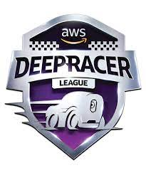

<!--StartFragment-->

DeepRacer is a platform that allows developers to learn about and experiment with reinforcement learning (RL) through an autonomous race car. The car is a 1/18th scale model that is controlled by a computer and can be programmed to navigate a physical track using machine learning algorithms. AWS DeepRacer is designed to be easy to use for developers of all skill levels, with a focus on making it easy to learn about and experiment with RL. The platform includes pre-built reinforcement learning models and simulation environments, as well as the ability to train and evaluate models in the cloud using [Amazon SageMaker.](https://www.geeksforgeeks.org/what-is-sagemaker-in-aws/)

The DeepRacer service includes an online racing league where developers can compete against each other to see whose autonomous car can complete the race track the fastest. It also includes a virtual racing league where developers can race their cars in a simulated environment. AWS DeepRacer can be used to learn about RL, develop and test reinforcement learning models, and create autonomous racing cars. It is designed to be accessible to developers of all skill levels and can help individuals and organizations develop and test reinforcement learning algorithms in a fun and engaging way.

<!--EndFragment-->

