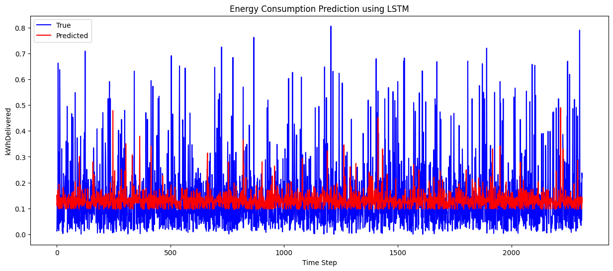

```
from sklearn.preprocessing import MinMaxScaler
from sklearn.model_selection import train_test_split
from sklearn.metrics import mean_absolute_error, mean_squared_error
from keras.models import Sequential
from keras.layers import LSTM, Dense, Dropout

# Assuming df is your original dataframe

# 1. Feature Engineering
df['hour'] = (df['connectionTime_seconds'] // 3600) % 24
df['day_of_week'] = (df['connectionTime_seconds'] // (3600*24)) % 7
df['month'] = (df['connectionTime_seconds'] // (3600*24*30)) % 12
df['hour_sin'] = np.sin(2 * np.pi * df['connectionTime_seconds'] / 86400)
df['hour_cos'] = np.cos(2 * np.pi * df['connectionTime_seconds'] / 86400)


# 2. Data Normalization
features_to_scale = ['kWhDelivered', 'WhPerMile', 'kWhRequested', 'milesRequested', 'minutesAvailable', 'hour', 'day_of_week', 'month']
scalers = {}

for feature in features_to_scale:
    scaler = MinMaxScaler()
    df[feature] = scaler.fit_transform(df[feature].values.reshape(-1, 1))
    scalers[feature] = scaler

# 3. Data Splitting and Sequence Preparation
def create_sequences(data, n_steps):
    X, y = [], []
    for i in range(len(data) - n_steps):
        X.append(data[i:i+n_steps])
        y.append(data[i+n_steps])
    return np.array(X), np.array(y)

train, test = train_test_split(df, test_size=0.2, shuffle=False)
n_steps = 10
X_train, y_train = create_sequences(train['kWhDelivered'].values, n_steps)
X_test, y_test = create_sequences(test['kWhDelivered'].values, n_steps)
X_train = X_train.reshape((X_train.shape[0], X_train.shape[1], 1))
X_test = X_test.reshape((X_test.shape[0], X_test.shape[1], 1))

# 4. LSTM Model with Regularization and Dropout
n_features = X_train.shape[2]
model = Sequential()
model.add(LSTM(50, activation='relu', return_sequences=True, input_shape=(n_steps, n_features)))
model.add(Dropout(0.2))
model.add(LSTM(50, activation='relu'))
model.add(Dropout(0.2))
model.add(Dense(1))
model.compile(optimizer='adam', loss='mse')

# 5. Train the LSTM Model
model.fit(X_train, y_train, epochs=200, verbose=1)

# 6. Predict and Evaluate
y_pred = model.predict(X_test)
mae = mean_absolute_error(y_test, y_pred)
rmse = np.sqrt(mean_squared_error(y_test, y_pred))

print(f"Mean Absolute Error: {mae}")
print(f"Root Mean Squared Error: {rmse}")

```

